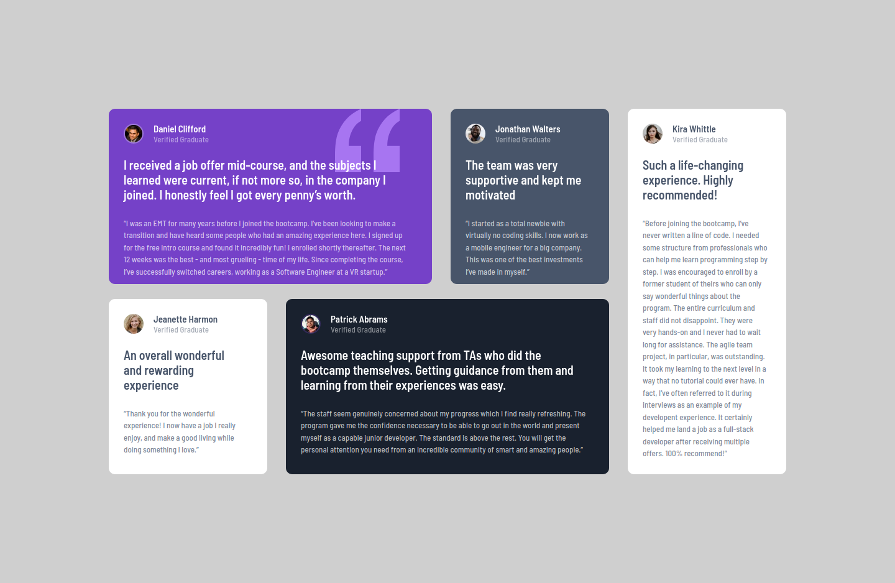

# Frontend Mentor - Testimonials grid section solution

This is a solution to the [Testimonials grid section challenge on Frontend Mentor](https://www.frontendmentor.io/challenges/testimonials-grid-section-Nnw6J7Un7). Frontend Mentor challenges help you improve your coding skills by building realistic projects.

## Table of contents

- [Overview](#overview)
  - [The challenge](#the-challenge)
  - [Screenshot](#screenshot)
  - [Links](#links)
  - [Built with](#built-with)
- [Author](#author)

## Overview

### The challenge

Users should be able to:

- View the optimal layout for the site depending on their device's screen size

### Screenshot

#### Desktop View

#### Mobile View

### Links

- Solution URL: [https://github.com/darielmedr/Frontend-Mentor-testimonials-grid-section](https://github.com/darielmedr/Frontend-Mentor-testimonials-grid-section)
- Live Site URL: [https://darielmedr.github.io/Frontend-Mentor-testimonials-grid-section/](https://darielmedr.github.io/Frontend-Mentor-testimonials-grid-section/)

### Built with

- Semantic HTML5 markup
- SCSS custom properties
- CSS Grid
- Mobile-first workflow

## Author

- Frontend Mentor - [@darielmedr](https://www.frontendmentor.io/profile/darielmedr)
- GitHub - [@darielmedr](https://github.com/darielmedr)
- LinkedIn - [Dariel Medina Rodríguez](https://www.linkedin.com/in/darielmedr)
